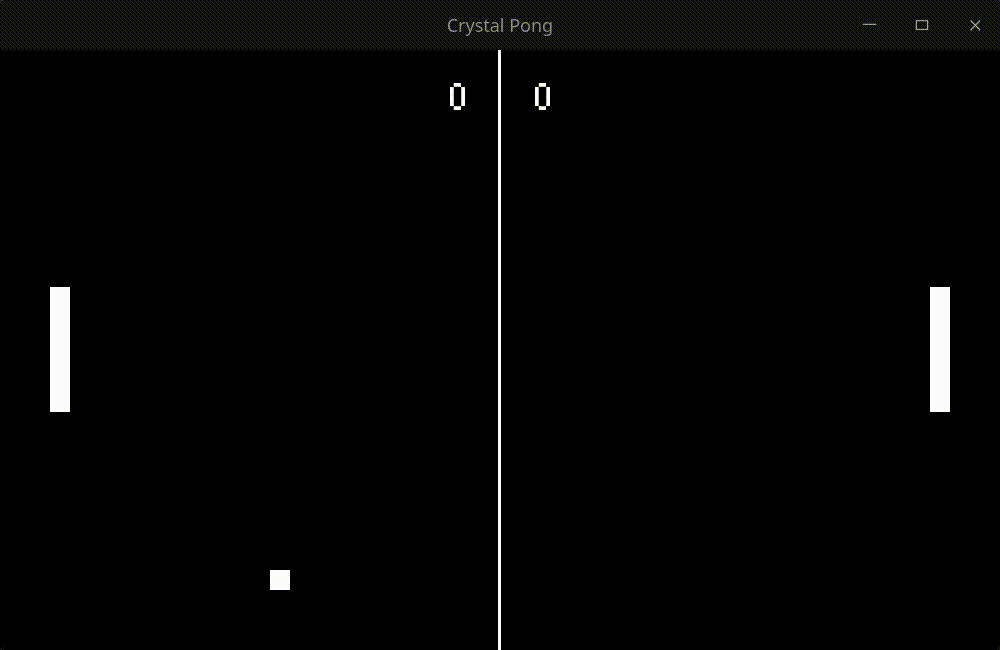

# Crystal Pong

Implementing the old Pong game with Crystal and [CrSFML](https://github.com/oprypin/crsfml) following this video from [Tantan](https://www.youtube.com/watch?v=TUE_HSgQiG0&ab_channel=Tantan).

## Running the game

In order to run the game locally you will just need the latest version of Crystal and run the following command.

- Fetch the dependencies and run the game:
```bash
$ shards install && crystal src/crystal_pong.cr
```

And voilà, the game is running.



## Contributing

1. Fork it (<https://github.com/your-github-user/crystal_pong/fork>)
2. Create your feature branch (`git checkout -b my-new-feature`)
3. Commit your changes (`git commit -am 'Add some feature'`)
4. Push to the branch (`git push origin my-new-feature`)
5. Create a new Pull Request

## Contributors

- [rubynho](https://github.com/your-github-user) - creator and maintainer
